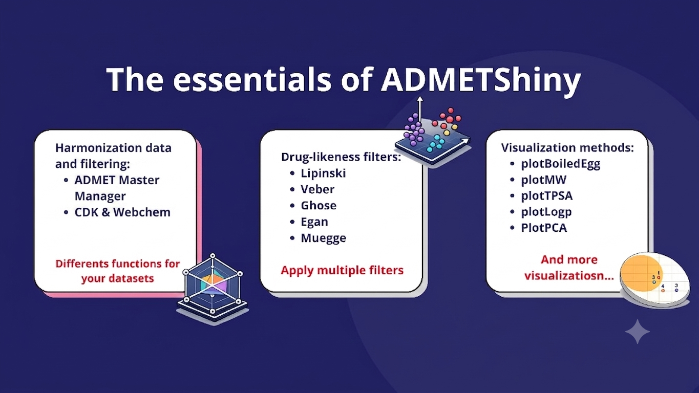
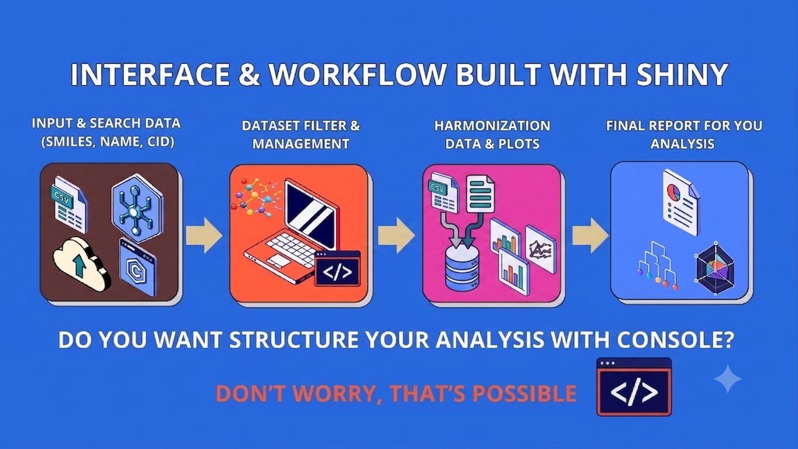
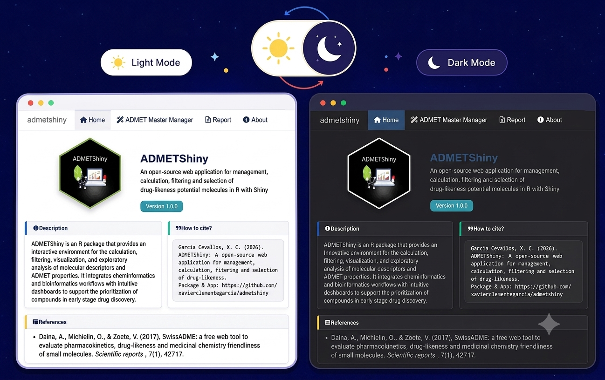
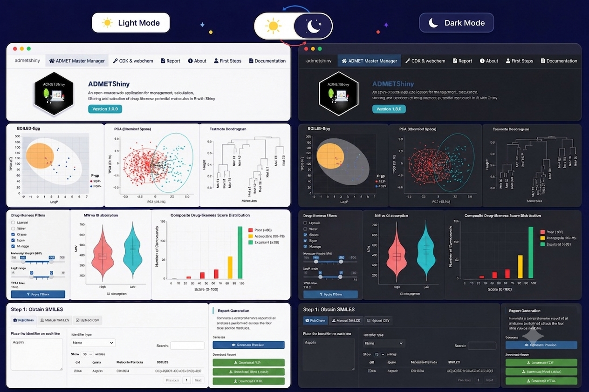

# ADMETShiny v1.0.0 *Espeletia hartwegiana*

Un mensaje en español para quienes lo lean...

*Bienvenidos a este proyecto nacido de una tesis en proceso y de un largo recorrido por la bioinformática en mi carrera de Biología.*

### What's ADMETShiny?

Admetshiny is an open-source R package that integrates code-based tools with a dual Shiny application interface to streamline drug discovery workflows. It facilitates the calculation of molecular descriptors via CDK and Webchem, standardizes heterogeneous ADMET datasets through its ADMET Master Manager, and applies prominent drug-likeness filters such as Lipinski’s and Veber’s rules. Furthermore, the package predicts pharmacokinetic endpoints including P-glycoprotein substrates and BOILED-Egg parameters, while enabling the generation of publication-ready visualizations and automated statistical reports like PCA, UMAP, and AGNES Tanimoto similarity dendrograms.

#### The essentials of this package

#### Interface & Workflow for coders and no-coders

##### But, Do you want structure your analysis with the R & RStudio console? Don't worry....

#### The Design & Interface

...

