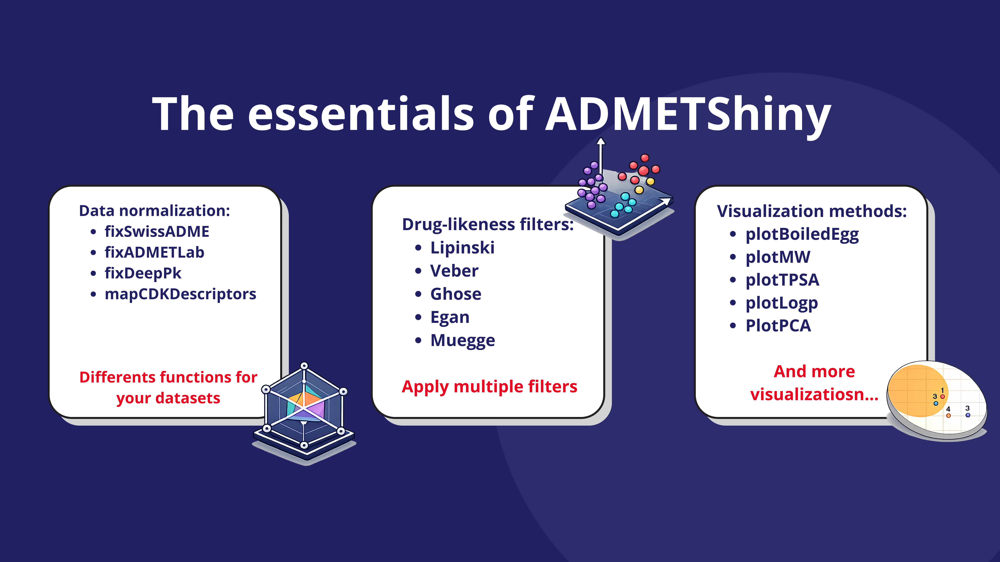
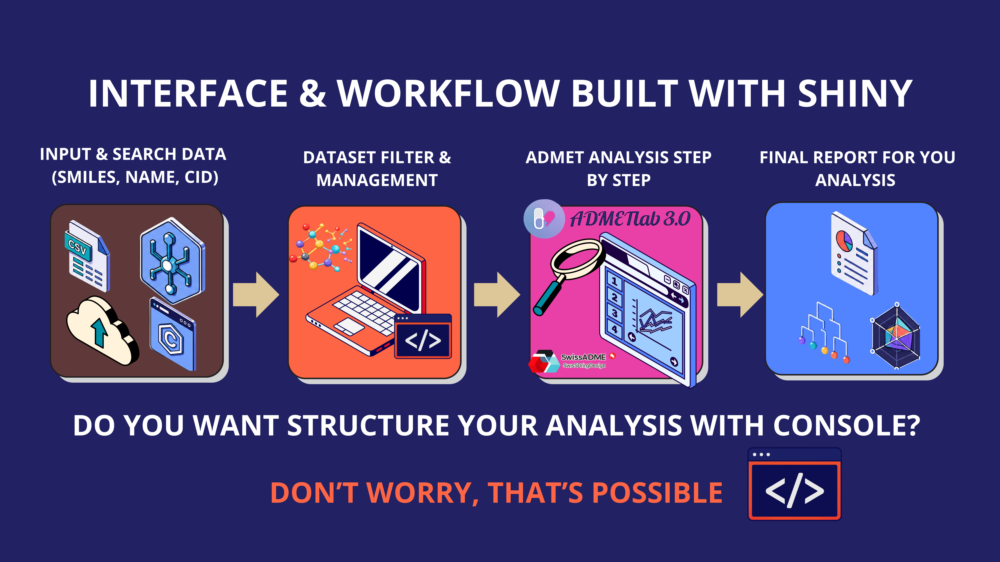
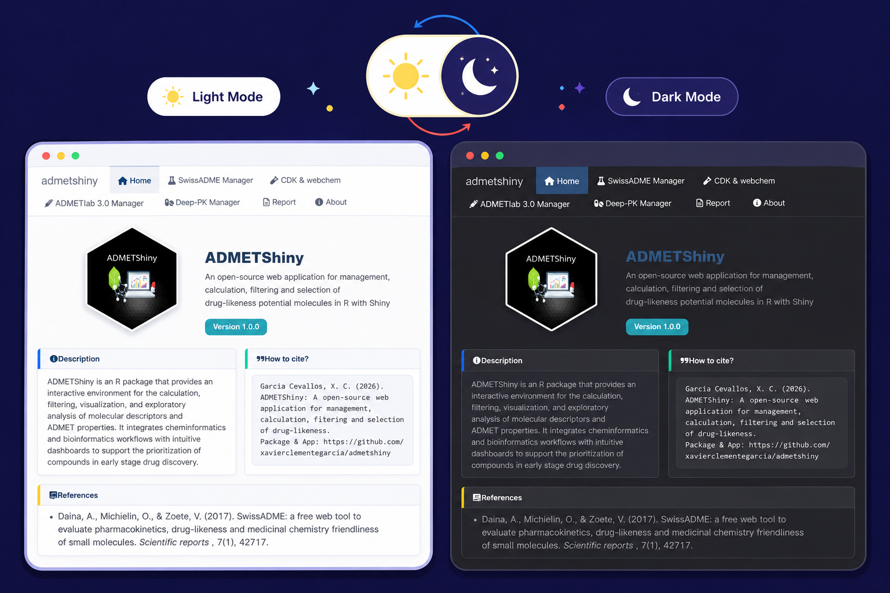
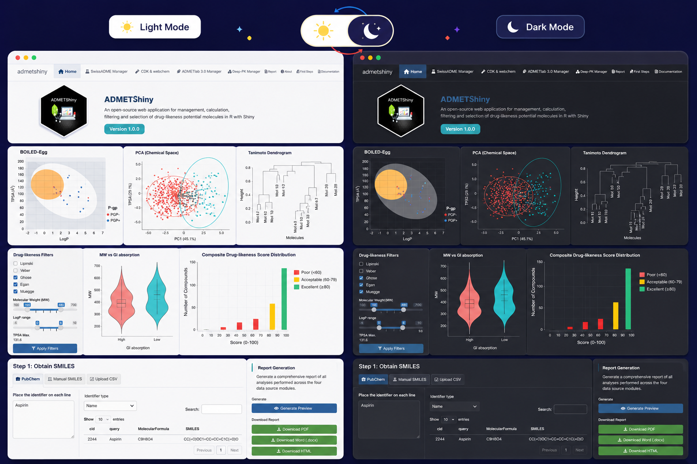

## Principal functions of ADMETShiny in R

With ADMETShiny, say goodbye to manual ADMET analysis although different Web-Servers. Now, you could management your physicochemical profiles in once only spot.

Finally, you could generate an once report about the principal characteristics of the each model.

If you're not estimate that's profile in external websites..., Don't Worry!, This Shiny include a web-local-server built with rCDK R package and Java SE Development Kit (JDK).

## One for open source and open source for one

**Input** data although of different methods (datasets in ".csv", search in PubChem with CID, common name, inchKey & CAS).

### Now, you can calculate drug-likeness properties with CDK & WebChem

The dataset & management filters could apply above to the properties *(molecular descriptors)* and get very easy reports.

{fig-align="center"}

### Yes, you could use the console for develop a simple reproducible script

And this isn't all! You could generate your reports with the console... :)

## The Shiny App for coders & no coders

**Built for both coders and non-coders**, ADMETShiny offers an intuitive graphical interface that makes advanced cheminformatics analyses accessible without programming experience, while remaining fully integrated with the R ecosystem for users who require reproducible, customizable, and extensible workflows.

{fig-align="center"}

## Knowledge structure analysis

ADMETShiny provides a comprehensive collection of interactive modules designed to streamline the early stages of drug discovery by integrating molecular retrieval, descriptor calculation, ADMET prediction, chemical space exploration, structural similarity analysis, and automated reporting into a single user-friendly environment.

{fig-align="center"}

Overall, ADMETShiny combines data retrieval, descriptor calculation, predictive modeling, interactive visualization, molecular prioritization, and automated reporting into a unified open-source platform specifically designed to accelerate computational drug discovery and medicinal chemistry research.