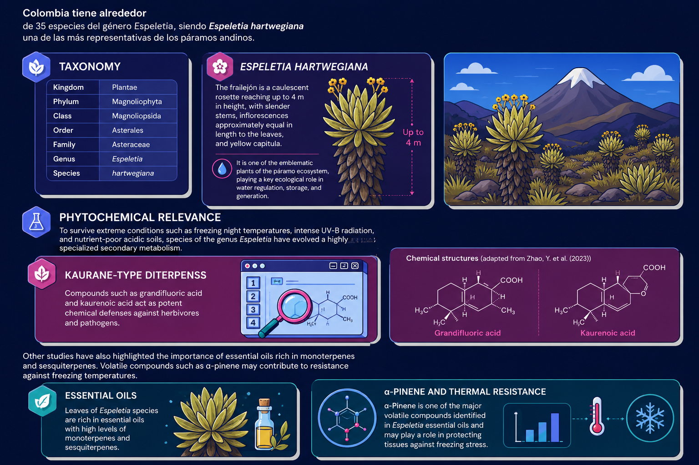
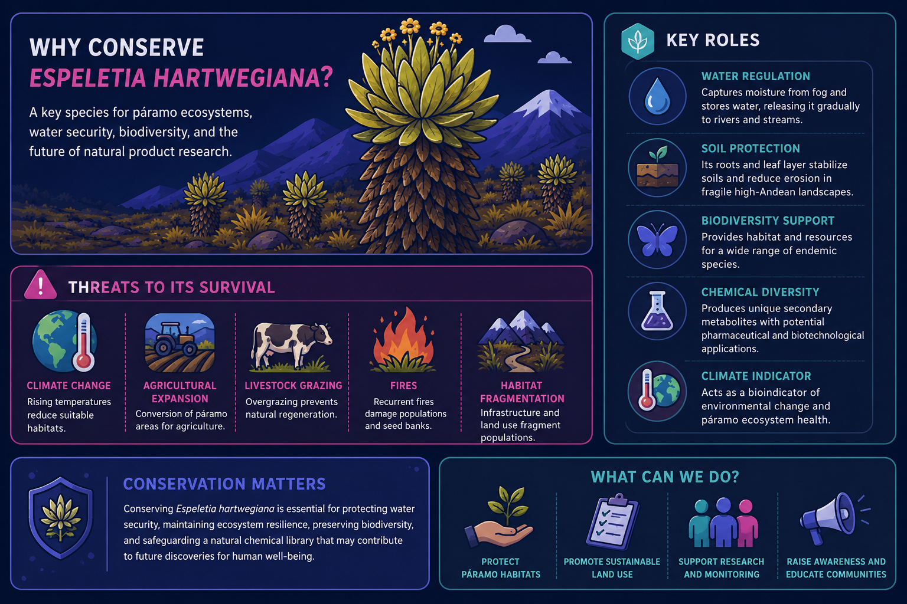

## The flagship specie

## ***Espeletia hartwegiana***

The **frailejón** is a caulescent rosette reaching up to 4 m in height, with slender stems, inflorescences approximately equal in length to the leaves, and yellow capitula.

It is one of the emblematic plants of the Colombian páramo ecosystem, playing a key ecological role in water regulation, storage, and generation.

{fig-align="center"}

Beyond its ecological function, *E. hartwegiana* supports a unique assemblage of microorganisms, insects, birds, and other high-Andean organisms that depend on páramo habitats. The species also represents an important reservoir of specialized secondary metabolites with promising pharmacological and biotechnological potential.

However, climate change, agricultural expansion, livestock grazing, recurrent fires, and habitat fragmentation are threatening natural populations throughout the northern Andes. Rising temperatures are expected to reduce suitable páramo habitats, forcing populations to migrate to higher elevations where available habitat becomes increasingly limited.

{fig-align="center"}

The conservation of *Espeletia hartwegiana* is therefore essential not only for preserving one of the world's most biodiverse mountain ecosystems, but also for safeguarding water security, ecological resilience, and the chemical diversity that may support future discoveries in natural product research and drug development.

{fig-align="center"}
