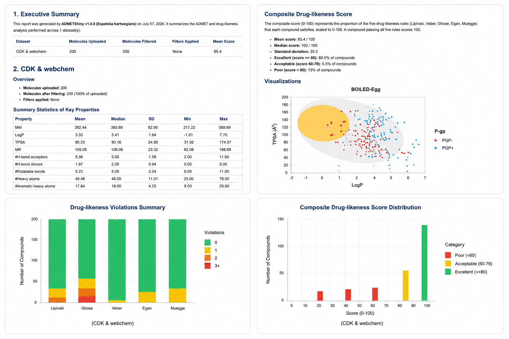

### Documentation

#### The user interface

This image displays the Navigation Guide for **ADMETShiny (Version 1.0.0)**, an open-source R Shiny web application designed for the management, calculation, filtering, and selection of drug-likeness potential molecules in early-stage drug discovery. The user interface features a top horizontal navigation bar split into nine numbered modules indicated by green hex icons: **(1) Home**, which returns to the main landing page; **(2) SwissADME Manager**, for calculating and analyzing molecular properties; **(3) CDK & webchem**, providing access to cheminformatics tools for structure processing and chemical analysis.

{fig-align="center"}

**(4) ADMETlab 3.0 Manager** and **(5) Deep-PK Manager**, which run predictive ADMET and pharmacokinetic models using third-party and deep learning architectures; **(6) Report**, for customizing and exporting analysis results; **(7) About**, detailing project and author information; **(8) First Steps**, offering step-by-step tutorials for new users; and **(9) Documentation**, which hosts technical guides and vignettes. Below this primary interface menu, the dashboard is split into two bottom sections highlighted by green pointers: a **Description** box on the left, summarizing the app's integration of bioinformatics and cheminformatics workflows for molecular descriptor visualization, and a **How to cite?** box on the right, providing the formal 2026 academic citation and the GitHub repository link

### The datasets example

This image details the user interface of the **SwissADME Manager** module within ADMETShiny, showcasing the data uploading, filtering, and table visualization capabilities. On the left side, the dashboard features a control panel where users can upload their chemical data via the **Upload SwissADME Dataset** tool **(3)**, which currently shows a completed upload of an example CSV file (`dataset_swissadme_example.csv`). Below this, the **Drug-likeness Filters** section **(4)** allows users to apply customizable filters based on popular medicinal chemistry criteria, including Lipinski, Veber, Ghose, Egan, and Muegge rules, along with adjustable threshold inputs for maximum molecular weight, logP, hydrogen bond acceptors/donors, and maximum Lipinski violations.

{fig-align="center"}

The main central area displays the **Filtered Results** table under the **Filtered Molecules** tab **(6)**, which renders a structured overview of the compounds that meet the set criteria. This interactive data grid displays key molecular descriptors such as the Molecule ID, Canonical SMILES, chemical Formula, Molecular Weight (MW), number of Heavy Atoms, and number of Aromatic Heavy Atoms. Users can utilize the **Search** bar **(8)** located at the top right of the table to quickly filter molecules by name, SMILES string, or specific properties. Additionally, the interface includes top tabs for **Data Preview** **(5)** and **Plots** **(7)** to seamlessly toggle between the raw dataset, the refined subsets, and data distributions, providing an intuitive, integrated workflow for compound prioritization.

### You probably need a report

The executive summary and statistical breakdown confirm that 100% of the library was successfully retained, exhibiting average baseline properties such as a Molecular Weight of 392.44, a LogP of 3.33, and a TPSA of 90.53. The library demonstrates high quality with a mean composite drug-likeness score of 85.4 out of 100, where 80.5% of the compounds achieve an "Excellent" classification.

{fig-align="center"}

These metrics are supported by three robust visualizations: a BOILED-Egg plot mapping gastrointestinal absorption and blood-brain barrier permeability alongside P-glycoprotein efflux status, a stacked bar chart detailing individual rule violations across standard medicinal chemistry criteria (Lipinski, Ghose, Veber, Egan, and Muegge), and a score distribution histogram that visually confirms the sharp clustering of the vast majority of the compounds within the highest drug-likeness tier.

### The conclusions

#### 
