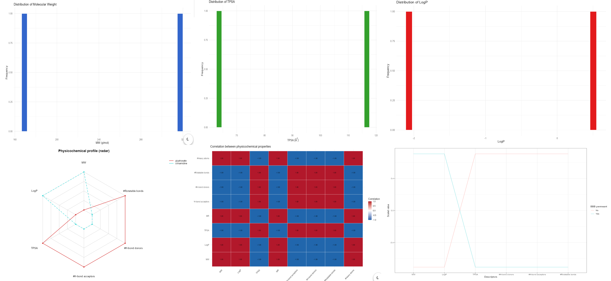
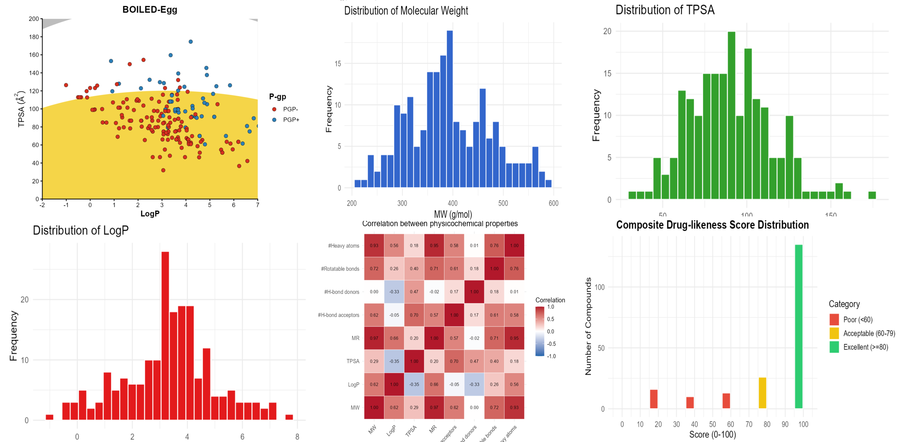
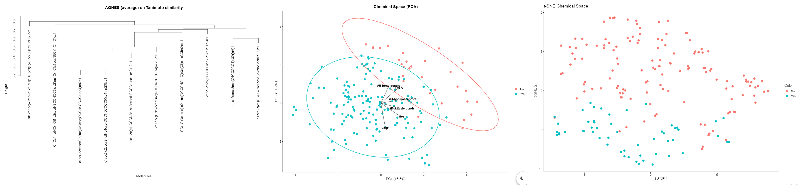
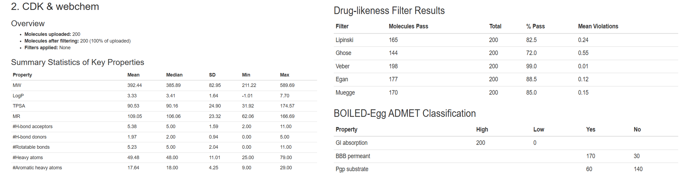

### Workflows & demonstrations

Below, we'll work through a simple example to help you easily filter, analyze, and report your molecular data. Remember that you must have all the necessary dependencies installed if you intend to follow this workflow exactly.

We'll begin with an example, which we'll call a "case study," using the crinamidine molecule and glyphosate.

#### Why are these two molecules so different?

In this case, it will simply be done in this way to evaluate the behavior and show the specific variations between the ADMET calculations reported in the datasets of SwissADME, ADMETLab 3.0, Deep pK learning and CDK & Webchem.

We suggest considering taking it directly from [**PubChem**](https://pubchem.ncbi.nlm.nih.gov) the canonical smiles of [**crinamidine**](https://pubchem.ncbi.nlm.nih.gov/compound/399204) y [**glyphosate**](https://pubchem.ncbi.nlm.nih.gov/compound/3496).

### Coconut: A Medicinal Latino-american plants dataset

*Antes que nada, sería importante comentar que en próximas versiones se adicionará este soporte con "Coconut" debido a su exclusiva dedicación con moléculas de plantas de origen sudamericano.*

### How do you get a BOILED-egg with ADMETShiny

{fig-align="center"}

Here's the explanation condensed into a single paragraph, ideal for a quick read or a conclusion: The results are fully consistent from a pharmacokinetic perspective, since both compounds respond to different molecular mechanisms: on the one hand, glyphosate is an extremely hydrophilic and polar molecule (log P approx -3.2) that lacks the lipophilicity necessary to cross the blood-brain barrier (BBB) ​​by passive diffusion; on the other hand, crinamidine has a favorable alkaloid structure that allows it to cross the BBB efficiently, and being negative for P-glycoprotein (PGP), it avoids being expelled by this efflux pump, successfully accumulating in the central nervous system.

{fig-align="center" width="615"}

The graphs visually confirm this molecular disparity through a stark bimodal profile: on one hand, glyphosate is at the lower end of the distributions with a strongly negative log P and an unfavorable TPSA, which contracts its profile on the radar plot and demonstrates its structural inability to dissolve in the lipid barrier (BBB). Conversely, crinamidine is at the opposite end with optimal lipophilicity and molecular weight values ​​that expand its radar profile toward the absorption zone; this, combined with its status as a non-substrate of the PGP pump, conclusively explains why this alkaloid manages to cross and accumulate in brain tissue, unlike the herbicide.

### Choosing the best secondaries metabolites

We've already seen how it works with two composites. However, some of ADMETShiny's charts require larger databases to find more complex patterns. In this case, we've used a database that the user can download as examples to upload within the program.

{fig-align="center"}

### The hard mission to the validations

{fig-align="center"}

Validating these ADMET results represents a complex challenge, as *in silico* prediction algorithms strictly depend on the chemical space with which they were trained. Modeling dynamic biological variables like Blood-Brain Barrier (BBB) permeability or P-glycoprotein (PGP) efflux involves simplifying intricate cellular interactions into static mathematical descriptors, which can easily lead to false positives or missed active transport effects.

{fig-align="center"}

Therefore, the strong theoretical coherence observed in your data between fundamental physicochemical properties (logP and TPSA) and the algorithmic classifications is crucial, as it mitigates software bias and provides robust scientific grounding before moving to *in vitro* testing.
