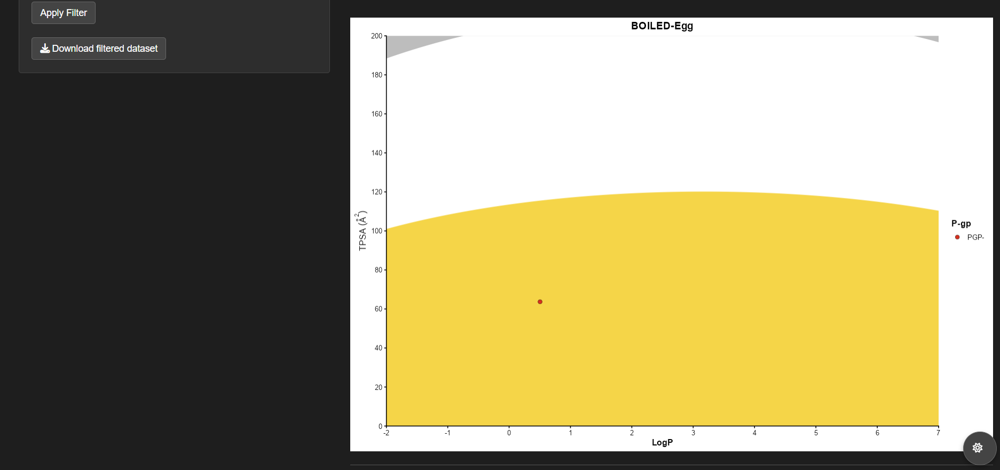

### Workflows & demonstrations

Below, we'll work through a simple example to help you easily filter, analyze, and report your molecular data. Remember that you must have all the necessary dependencies installed if you intend to follow this workflow exactly.

We'll begin with an example, which we'll call a "case study," using the crinamidine molecule and glyphosate.

#### Why are these two molecules so different?

In this case, it will simply be done in this way to evaluate the behavior and show the specific variations between the ADMET calculations reported in the datasets of SwissADME, ADMETLab 3.0, Deep pK learning and CDK & Webchem.

We suggest considering taking it directly from [**PubChem**](https://pubchem.ncbi.nlm.nih.gov) the canonical smiles of [**crinamidine**](https://pubchem.ncbi.nlm.nih.gov/compound/399204) y [**glyphosate**](https://pubchem.ncbi.nlm.nih.gov/compound/3496).

### Coconut: A Medicinal Latino-american plants dataset

*Antes que nada, sería importante comentar que en próximas versiones se adicionará este soporte con "Coconut" debido a su exclusiva dedicación con moléculas de plantas de origen sudamericano.*

### How do you get a BOILED-egg with ADMETShiny

{fig-align="center"}

### Choosing the best secundaries metabolites

### The hard mission to the validations  
